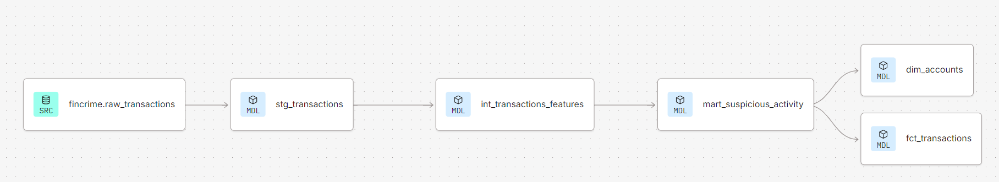
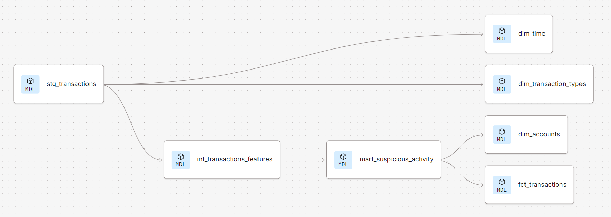
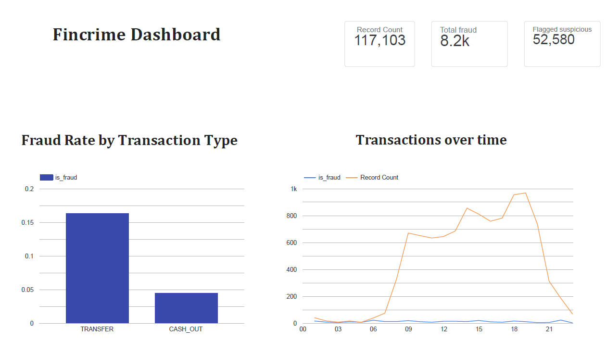

# FinCrime Transaction Monitoring — BigQuery · dbt · Looker Studio

A transaction-monitoring analytics pipeline built on a modern challenger-bank analytics stack: raw payment data landed in **BigQuery**, transformed and tested with **dbt** into a dimensional star schema, scored for fraud risk, evaluated against real labels, and surfaced in a **Looker Studio** dashboard.

Built by an operator-analyst: someone who has run frontline operations *and* builds the data tools to improve them. This project is the transaction-monitoring layer of a wider financial-crime portfolio (see [Where this fits](#where-this-fits)).

---

## Overview

The goal was to reproduce, end to end, the analytics-engineering workflow a FinCrime data team uses: take raw transaction data, model it into reliable, tested datasets, engineer fraud signals, score transactions, and measure how well the scoring works — honestly.

Everything here runs on the free BigQuery sandbox and free dbt/Looker Studio tiers, so it is fully reproducible at zero cost.

---

## Stack

| Layer | Tool |
|-------|------|
| Warehouse | Google BigQuery (EU region) |
| Transformation | dbt Core (dbt Studio, managed repo) |
| Visualisation | Looker Studio |
| Cloud | Google Cloud Platform |


---

## Architecture

The pipeline is a layered dbt project ending in a star schema:

```
raw_transactions (source)
        │
   stg_transactions          -- clean, renamed staging model (+ data-quality tests)
        │
 int_transactions_features   -- balance-error features; filtered to fraud-bearing types
        │
 mart_suspicious_activity     -- rule-based risk scoring + is_suspicious flag (table)
        │
   fct_transactions           -- central FACT table
     ┌──────┼──────┐
 dim_time  dim_accounts  dim_transaction_types   -- dimensions (relationships-tested)
```



---

## The data

**Source:** PaySim, a public synthetic mobile-money dataset with labelled fraud (`isFraud`).

**Honest note on sampling:** the full dataset (~6.3M rows) was subsampled to ~258k rows, keeping **all** fraudulent transactions (8,213) plus a random sample of legitimate ones. This preserves the fraud signal for learning but **inflates fraud prevalence** well above the real ~0.13%. The pipeline (`fct_transactions`) is filtered to the two fraud-bearing types, TRANSFER and CASH_OUT — 117,103 transactions, of which 8,213 are fraud.

---

## The models

**`stg_transactions`** — staging. Light cleanup only: renames PaySim's inconsistent columns (e.g. `oldbalanceOrg` vs `newbalanceOrig`) into clean `snake_case`. No business logic — that lives downstream. Materialised as a view.

**`int_transactions_features`** — intermediate. Filters to TRANSFER/CASH_OUT and engineers the **balance-error features**:
- `error_balance_orig = origin_balance_after + amount − origin_balance_before`
- `error_balance_dest = dest_balance_before + amount − dest_balance_after`

For a clean transaction these should be ≈ 0 (money is conserved). A large error means the balances don't reconcile — the core fraud tell in PaySim. These are per-transaction signals, which work here because account-based signals (velocity, structuring) don't: PaySim accounts barely repeat.

**`mart_suspicious_activity`** — analyst-facing scoring mart (materialised as a table). Scores each transaction against three rules → `risk_score` (0–3) → `is_suspicious` when `risk_score >= 2`:
1. `flag_zero_dest_balance` — destination balance zero before and after (strongest tell)
2. `flag_origin_emptied` — origin account drained by the transaction
3. `flag_large_amount` — amount ≥ 200,000 (tunable)

**Star schema** — `fct_transactions` (fact: one row per transaction, measures + foreign keys) joined to `dim_time` (relative time from `step`), `dim_accounts` (entity-level account behaviour), and `dim_transaction_types` (fraud rate per type).

---

## Data quality & testing

Every model is tested; `dbt build` runs all models and tests in dependency order. Three test types are used:

- **`not_null`** — required fields (amount, accounts) are never empty.
- **`accepted_values`** — `transaction_type` only ever contains the five valid PaySim categories; `is_fraud` only 0/1.
- **`relationships`** — referential integrity: every foreign key in `fct_transactions` exists in its dimension (no orphan records).

This mirrors the reliability and auditability a regulated bank requires: any figure in a report can be traced through tested models back to raw data.

---

## Evaluation

The `is_suspicious` flag was evaluated against the real `is_fraud` label (confusion matrix), then **tuned** by changing the risk-score threshold.

| Threshold | Recall (fraud caught) | Precision (flags that are real) | False alarms |
|-----------|----------------------|--------------------------------|--------------|
| `risk_score >= 2` | **83%** | 13% | 45,760 |
| `risk_score >= 3` | 31% | **99.4%** | 16 |

**Reading it:** at `>= 2` the screen is high-recall / low-precision — it catches ~5 of every 6 frauds but over-flags heavily. Tightening to `>= 3` collapses false alarms from 45,760 to 16 (99.4% precision) but misses most fraud. Neither is "correct": the threshold is a **business decision** trading the cost of missed fraud against the cost of analyst time —

- `>= 2` suits a **first-line screen** (catch nearly everything; humans triage the noise).
- `>= 3` suits an **auto-action** system (act only when near-certain).

The pipeline ships at `>= 2` as the default, first-line-screening operating point.

---

## Dashboard

A Looker Studio dashboard reads directly from `fct_transactions`:

- **Scorecards** — 117,103 transactions · 8,213 fraud · 52,580 flagged suspicious
- **Fraud rate by transaction type** — TRANSFER (~16%) and CASH_OUT (~4.5%); all other types 0%
- **Activity over time** — transaction volume and fraud count across the simulation run


---

## Key findings

- Fraud occurs **only** in TRANSFER and CASH_OUT; the other three types carry none.
- The **destination-side balance error** is the strongest single fraud signal — fraudulent transactions leave the receiving account's balance unreconciled.
- Account-based signals (velocity, structuring) are weak on PaySim because accounts rarely repeat — a data-quality reality worth stating, not hiding.

---

## Limitations & honest scoping

Stated deliberately — knowing a dataset's limits is core to FinCrime analysis:

- **Synthetic data.** PaySim is generated, not real. This demonstrates modelling, testing, and tooling — not real-world detection rates.
- **Inflated fraud prevalence** from keeping all fraud rows when subsampling (see [The data](#the-data)).
- **Relative time, not calendar time.** `dim_time` derives from `step` (elapsed hours). It supports velocity and hour-of-day analysis but **not** day-of-week / holiday / seasonal features, which would be meaningless on synthetic timestamps.
- **Account-level metrics are latent.** `dim_accounts` computes a suspicious rate per account, but PaySim accounts barely repeat, so the metric is mostly 0/1 here. The model would rank genuine risk on real data with repeating accounts.
- **Rule-based, not ML.** Scoring uses three transparent rules, not a trained model — chosen for interpretability and auditability.
- **Looker Studio, not LookML.** Visualised in Looker Studio; I have not written production LookML (the enterprise semantic layer). I understand it as the layer that sits on top of dbt marts — this is my primary learning gap on this stack.

---

## What this demonstrates

- **BigQuery**: cost-aware querying, window functions, nested data, partitioning/clustering concepts.
- **dbt**: sources, staging/intermediate/mart layering, materializations, three test types, a dimensional star schema, lineage/DAG.
- **Analytics judgement**: feature engineering grounded in the data, honest evaluation with precision/recall, threshold tuning as a business trade-off, and explicit scoping of limitations.
- **BI**: connecting a warehouse to a dashboard, dimensions vs metrics, calculated fields, coherent multi-chart design.

---

## How to run

1. Land the PaySim subsample into BigQuery as `raw_transactions` (EU region).
2. Configure dbt against the BigQuery connection (dbt Core / Latest engine; location EU).
3. `dbt build` — builds all models and runs all tests in order.
4. Connect Looker Studio to `fct_transactions` and rebuild the dashboard.

Model code lives in `/models`; exploratory and evaluation SQL in `/explore`.

---

## Where this fits

This is the **transaction-monitoring** layer of a three-part financial-crime portfolio:

- **AML Risk Radar** — sanctions / watchlist screening (structured list matching)
- **Provenance** — adverse-media / EDD intelligence (unstructured open-web reasoning)
- **This project** — transaction monitoring & warehouse modelling (internal data)

Together they span the due-diligence stack — screening, open-source intelligence, and internal analytics — built on the tools a modern FinCrime data team actually uses.

